# 📋 Dokumentasi Teknis — ERP Almubarok

> **Versi:** 0.1.0 · **Tanggal Dokumen:** 4 Juni 2026  
> **Stack:** Next.js 16 · SQLite (Better-SQLite3) · Drizzle ORM · TypeScript · TailwindCSS v4

---

## Daftar Isi

1. [Gambaran Umum Sistem](#1-gambaran-umum-sistem)
2. [Teknologi & Dependensi](#2-teknologi--dependensi)
3. [Struktur Direktori](#3-struktur-direktori)
4. [Sistem Autentikasi](#4-sistem-autentikasi)
5. [Skema Database](#5-skema-database)
6. [Relasi Antar Tabel (ERD)](#6-relasi-antar-tabel-erd)
7. [Modul & Halaman Aplikasi](#7-modul--halaman-aplikasi)
8. [API Endpoints](#8-api-endpoints)
9. [Logika Bisnis Inti](#9-logika-bisnis-inti)
10. [Manajemen Role & Akses Menu](#10-manajemen-role--akses-menu)
11. [Panduan Pengembangan](#11-panduan-pengembangan)

---

## 1. Gambaran Umum Sistem

ERP Almubarok adalah sistem Enterprise Resource Planning (ERP) berbasis web yang dirancang untuk keperluan manajemen operasional lembaga/toko multi-cabang. Sistem ini mencakup modul:

| Modul | Fungsi Utama |
|---|---|
| **HRD** | Manajemen SDM: abdi, jabatan, absensi, izin/cuti, penggajian (bisyaroh) |
| **Penjualan (POS)** | Kasir point-of-sale, riwayat transaksi, poin pelanggan, infaq |
| **Pembelian** | Purchase Order (PO), faktur beli, hutang supplier |
| **Stok** | Manajemen stok barang per cabang |
| **Mutasi Cabang** | Permintaan & pengiriman barang antar cabang |
| **Akuntansi** | Chart of Accounts (COA), jurnal umum, laporan keuangan |
| **Promo** | Manajemen promosi: diskon, poin, hadiah, tebus murah |
| **Master Data** | Barang, kategori, supplier, pelanggan, cabang |
| **Pengaturan** | Role & akses menu per jabatan |

---

## 2. Teknologi & Dependensi

### Runtime & Framework
| Paket | Versi | Keterangan |
|---|---|---|
| `next` | 16.2.6 | Framework React fullstack (App Router) |
| `react` | 19.2.4 | UI Library |
| `typescript` | ^5 | Bahasa pemrograman |
| `tailwindcss` | ^4 | CSS utility framework |

### Database & ORM
| Paket | Versi | Keterangan |
|---|---|---|
| `better-sqlite3` | ^12.10.0 | Driver SQLite untuk Node.js |
| `drizzle-orm` | ^0.45.2 | Type-safe ORM untuk SQLite |
| `drizzle-kit` | ^0.31.10 | CLI untuk migrasi & generate skema |

### Autentikasi & Keamanan
| Paket | Versi | Keterangan |
|---|---|---|
| `jose` | ^6.2.3 | JWT sign & verify (HS256, exp 8 jam) |
| `bcryptjs` | ^3.0.3 | Hashing password |

### UI Components
| Paket | Keterangan |
|---|---|
| `@radix-ui/*` | Komponen primitif: Dialog, Select, Tabs, Toast, Popover, dll |
| `lucide-react` | Icon library |
| `recharts` | Library chart/grafik |
| `next-themes` | Dukungan dark/light mode |
| `date-fns` | Utilitas manipulasi tanggal |
| `xlsx` | Export data ke Excel |
| `jsqr` | Scanner barcode via kamera browser |

### Scripts NPM
```bash
npm run dev               # Development server
npm run build             # Production build
npm run db:generate       # Generate migrasi Drizzle
npm run db:migrate        # Jalankan migrasi
npm run db:push           # Push skema langsung ke DB
npm run db:seed           # Seed data awal
npm run db:migrate-pelanggan  # Migrasi data pelanggan dari MySQL
npm run db:migrate-promo      # Migrasi data promo dari MySQL
```

---

## 3. Struktur Direktori

```
erp-almubarok-nextjs/
│
├── erp-almubarok.db          # File database SQLite (WAL mode)
├── drizzle.config.ts          # Konfigurasi Drizzle ORM
├── next.config.ts             # Konfigurasi Next.js
├── tsconfig.json              # Konfigurasi TypeScript
│
├── scripts/                   # Script bantu (seed, migrasi legacy)
│
└── src/
    ├── proxy.ts               # Middleware autentikasi (JWT guard)
    │
    ├── lib/
    │   ├── auth/
    │   │   ├── jwt.ts         # Sign/verify JWT token (jose)
    │   │   ├── password.ts    # Hash & compare password (bcryptjs)
    │   │   └── session.ts     # getServerSession() dari cookie
    │   │
    │   ├── db/
    │   │   ├── index.ts       # Koneksi SQLite + inisialisasi Drizzle
    │   │   └── schema.ts      # Seluruh definisi tabel & TypeScript types
    │   │
    │   ├── image.ts           # Utilitas upload/resize gambar
    │   └── utils.ts           # Fungsi umum: format currency, date, dll
    │
    ├── components/
    │   ├── layout/
    │   │   ├── Sidebar.tsx    # Navigasi sidebar dengan role-based menu
    │   │   ├── UserMenu.tsx   # Dropdown profil user di header
    │   │   ├── ThemeToggle.tsx # Toggle dark/light mode
    │   │   ├── HelpButton.tsx # Floating help button (panduan manual)
    │   │   └── Logo.tsx       # Komponen logo aplikasi
    │   └── theme-provider.tsx # Context provider tema (next-themes)
    │
    └── app/
        ├── layout.tsx          # Root layout (ThemeProvider, font, metadata)
        ├── page.tsx            # Root redirect → /dashboard
        ├── globals.css         # CSS global, design tokens, tema
        │
        ├── login/              # Halaman login
        │
        ├── (dashboard)/        # Route group dashboard (protected)
        │   ├── layout.tsx      # Layout dashboard: Sidebar + Header + auth guard
        │   │
        │   ├── dashboard/      # Halaman utama dashboard
        │   ├── profil/         # Profil user
        │   ├── ubah-password/  # Ganti password
        │   │
        │   ├── hrd/            # Modul HRD
        │   │   ├── users/      # Daftar & manajemen abdi
        │   │   ├── jabatan/    # Master jabatan
        │   │   ├── absensi/    # Rekap absensi
        │   │   ├── jam-kerja/  # Pengaturan shift kerja
        │   │   ├── hari-libur/ # Daftar hari libur nasional/khusus
        │   │   ├── izin-cuti/  # Pengajuan & approval izin/cuti
        │   │   └── bisyaroh/   # Penggajian (bisyaroh)
        │   │
        │   ├── penjualan/      # Modul Penjualan
        │   │   ├── pos/        # Kasir POS (Point of Sale)
        │   │   ├── history/    # Riwayat transaksi
        │   │   └── promo/      # Manajemen promo aktif
        │   │
        │   ├── pembelian/      # Modul Pembelian
        │   │   ├── po/         # Purchase Order
        │   │   ├── invoice/    # Faktur pembelian (receiving)
        │   │   └── hutang/     # Hutang & pembayaran ke supplier
        │   │
        │   ├── stok/           # Manajemen stok barang
        │   │
        │   ├── mutasi/         # Mutasi barang antar cabang
        │   │   ├── request/    # Permintaan barang (dari cabang penerima)
        │   │   ├── kirim/      # Pengiriman barang (dari cabang sumber)
        │   │   ├── terima/     # Penerimaan barang
        │   │   └── selisih/    # Penanganan selisih pengiriman
        │   │
        │   ├── akuntansi/      # Modul Akuntansi
        │   │   ├── tipe/       # Tipe akun (Aset, Kewajiban, dll)
        │   │   ├── coa/        # Chart of Accounts / Daftar akun
        │   │   ├── jurnal/     # Input & lihat jurnal umum
        │   │   └── laporan/    # Laporan keuangan (Neraca, L/R)
        │   │
        │   ├── barang/         # Master data barang
        │   ├── kategori/       # Master kategori barang
        │   ├── supplier/       # Master supplier
        │   ├── pelanggan/      # Master pelanggan & poin
        │   ├── cabang/         # Master cabang
        │   └── pengaturan/
        │       └── role-menu/  # Konfigurasi akses menu per jabatan
        │
        └── api/                # API Routes (Next.js Route Handlers)
            ├── auth/
            │   └── login/      # POST /api/auth/login
            ├── barang/
            ├── kategori/
            ├── supplier/
            ├── pelanggan/
            ├── cabang/
            ├── user/
            ├── penjualan/      # GET & POST transaksi kasir
            ├── promo/
            ├── voucher/
            ├── pembelian/
            │   ├── po/
            │   ├── invoice/
            │   └── hutang/
            ├── stok/
            ├── mutasi/
            │   ├── request/
            │   ├── kirim/
            │   ├── terima/
            │   └── selisih/
            ├── hrd/
            │   ├── users/
            │   ├── jabatan/
            │   ├── absensi/
            │   ├── jam-kerja/
            │   ├── hari-libur/
            │   ├── izin-cuti/
            │   ├── gaji-jabatan/
            │   └── bisyaroh/
            └── akuntansi/
                ├── tipe-akun/
                ├── daftar-akun/
                ├── jurnal/
                └── laporan/
```

---

## 4. Sistem Autentikasi

### Alur Login

```
[User Input] → POST /api/auth/login
    ↓
Cek login_attempts (rate-limit: max 5x / 15 menit)
    ↓
Query tabel users → verifikasi password (bcryptjs.compare)
    ↓
Generate JWT (HS256, exp 8 jam) via jose
    ↓
Set HttpOnly cookie "erp_token"
    ↓
Redirect → /dashboard
```

### Middleware Guard (`src/proxy.ts`)

Semua request melewati `proxy()` yang:
1. Melewatkan path publik: `/login`, `/api/auth/login`, `/_next`, `/favicon`
2. Membaca cookie `erp_token`
3. Verifikasi JWT → jika invalid: redirect `/login` + hapus cookie
4. Jika valid: inject header `x-user-id`, `x-user-name`, `x-jabatan-id`, `x-cabang-id` untuk dipakai Server Components

### JWT Payload

```typescript
interface JWTPayload {
  id: number;          // ID user
  kode_user: string;   // Kode unik user
  nama_user: string;   // Nama lengkap
  id_jabatan: number | null;
  id_cabang: number | null;
  jabatan?: string;    // Nama jabatan (opsional)
}
```

### Session di Server Component

```typescript
// src/lib/auth/session.ts
const session = await getServerSession();
// Membaca cookie → verifyToken → return JWTPayload | null
```

---

## 5. Skema Database

Database: **SQLite** (file `erp-almubarok.db`)  
Mode: **WAL (Write-Ahead Logging)** + **Foreign Keys ON**

---

### 5.1 Modul HRD

#### Tabel `jabatan`
| Kolom | Tipe | Keterangan |
|---|---|---|
| `id_jabatan` | INTEGER PK AI | ID jabatan |
| `jabatan` | TEXT NOT NULL | Nama jabatan |

#### Tabel `users` (Abdi/Karyawan)
| Kolom | Tipe | Keterangan |
|---|---|---|
| `id` | INTEGER PK AI | ID user |
| `kode_user` | TEXT NOT NULL | Kode unik user |
| `nama_user` | TEXT NOT NULL | Nama lengkap |
| `tempat_lahir` | TEXT | Tempat lahir |
| `tanggal_lahir` | TEXT | Tanggal lahir |
| `no_ktp` | TEXT | Nomor KTP |
| `pendidikan_terakhir` | TEXT | Riwayat pendidikan |
| `riwayat_lembaga` | TEXT | Riwayat lembaga |
| `riwayat_pekerjaan` | TEXT | Riwayat pekerjaan |
| `status` | ENUM | `Abdi Tetap` / `Kontrak` / `Training` / `Non-Aktif` |
| `no_hp` | TEXT NOT NULL | Nomor handphone |
| `foto` | TEXT | Path/URL foto profil |
| `password` | TEXT NOT NULL | Bcrypt hash password |
| `id_jabatan` | INTEGER FK→jabatan | Jabatan yang diampu |
| `id_cabang` | INTEGER FK→cabang | Cabang tempat bertugas |
| `tanggal_masuk` | TEXT | Tanggal bergabung |
| `updated_at` | TEXT | Timestamp update terakhir |

#### Tabel `absensi`
| Kolom | Tipe | Keterangan |
|---|---|---|
| `id` | INTEGER PK AI | ID absensi |
| `user_id` | INTEGER NOT NULL FK→users | ID abdi |
| `tanggal` | TEXT NOT NULL | Tanggal (YYYY-MM-DD) |
| `jam` | TEXT NOT NULL | Jam absen (HH:MM:SS) |
| `jenis` | ENUM NOT NULL | `masuk` / `pulang` / `istirahat_keluar` / `istirahat_masuk` / `lembur_mulai` / `lembur_selesai` |
| `shift` | TEXT | Nama shift |
| `latitude` | TEXT | Koordinat GPS |
| `longitude` | TEXT | Koordinat GPS |
| `status_lokasi` | ENUM | `valid` / `invalid` |
| `catatan` | TEXT | Catatan tambahan |
| `created_at` | TEXT | Timestamp |

#### Tabel `jam_kerja` (Shift)
| Kolom | Tipe | Keterangan |
|---|---|---|
| `id` | INTEGER PK AI | ID shift |
| `nama_shift` | TEXT NOT NULL | Nama shift (misal: Pagi, Sore) |
| `jam_masuk` | TEXT NOT NULL | Jam masuk ideal |
| `jam_masuk_batas_akhir` | TEXT NOT NULL | Batas toleransi masuk |
| `jam_pulang` | TEXT NOT NULL | Jam pulang ideal |
| `jam_pulang_batas_awal` | TEXT NOT NULL | Batas awal boleh pulang |
| `keterangan` | TEXT | Deskripsi tambahan |

#### Tabel `hari_libur`
| Kolom | Tipe | Keterangan |
|---|---|---|
| `id` | INTEGER PK AI | ID |
| `tanggal` | TEXT NOT NULL | Tanggal libur |
| `nama_libur` | TEXT NOT NULL | Nama hari libur |
| `keterangan` | TEXT | Keterangan tambahan |

#### Tabel `izin_cuti`
| Kolom | Tipe | Keterangan |
|---|---|---|
| `id` | INTEGER PK AI | ID pengajuan |
| `user_id` | INTEGER NOT NULL FK→users | Pemohon |
| `jenis` | ENUM NOT NULL | `izin` / `cuti` / `sakit` / `lainnya` |
| `tanggal_mulai` | TEXT NOT NULL | Mulai tidak masuk |
| `tanggal_selesai` | TEXT NOT NULL | Akhir tidak masuk |
| `keterangan` | TEXT | Alasan |
| `bukti_file` | TEXT | Path file lampiran |
| `status` | ENUM | `pending` / `approved` / `rejected` |
| `tanggal_pengajuan` | TEXT | Waktu pengajuan (auto) |
| `tanggal_approval` | TEXT | Waktu keputusan |
| `approver_id` | INTEGER FK→users | Siapa yang meng-approve |
| `catatan_approval` | TEXT | Catatan approver |

#### Tabel `hutang_karyawan`
| Kolom | Tipe | Keterangan |
|---|---|---|
| `id` | INTEGER PK AI | ID |
| `user_id` | INTEGER NOT NULL FK→users | Abdi yang berhutang |
| `nominal` | INTEGER NOT NULL | Jumlah hutang |
| `tanggal` | TEXT NOT NULL | Tanggal hutang |
| `keterangan` | TEXT | Keterangan |
| `status` | ENUM | `aktif` / `lunas` |

#### Tabel `daftar_gaji_jabatan`
| Kolom | Tipe | Keterangan |
|---|---|---|
| `id` | INTEGER PK AI | ID |
| `id_jabatan` | INTEGER NOT NULL FK→jabatan | Jabatan |
| `gaji_pokok` | INTEGER NOT NULL | Gaji pokok per bulan |
| `gaji_per_jam` | INTEGER NOT NULL | Upah per jam kerja |
| `lembur_per_jam` | INTEGER NOT NULL DEFAULT 0 | Upah lembur per jam |
| `updated_at` | TEXT | Timestamp update |

#### Tabel `bisyaroh` (Penggajian)
| Kolom | Tipe | Keterangan |
|---|---|---|
| `id` | INTEGER PK AI | ID slip gaji |
| `user_id` | INTEGER NOT NULL FK→users | Abdi |
| `bulan` | INTEGER NOT NULL | Bulan (1-12) |
| `tahun` | INTEGER NOT NULL | Tahun |
| `gaji_pokok` | INTEGER | Gaji pokok dipakai |
| `gaji_per_jam` | INTEGER | Rate per jam |
| `lembur_per_jam` | INTEGER | Rate lembur |
| `hari_kerja` | INTEGER | Jumlah hari kerja aktual |
| `total_jam_kerja` | INTEGER | Total jam kerja (menit) |
| `total_jam_lembur` | INTEGER | Total jam lembur (menit) |
| `gaji_kehadiran` | INTEGER | Komponen gaji dari jam kerja |
| `gaji_lembur` | INTEGER | Komponen gaji lembur |
| `tunjangan` | INTEGER | Tunjangan tambahan |
| `potongan` | INTEGER | Potongan (hutang, dll) |
| `total_diterima` | INTEGER | Total take-home pay |
| `status` | ENUM | `Draft` / `Lunas` |
| `tanggal_bayar` | TEXT | Tanggal realisasi bayar |
| `catatan` | TEXT | Catatan payroll |
| `created_at` / `updated_at` | TEXT | Timestamps |

---

### 5.2 Modul Master Data

#### Tabel `cabang`
| Kolom | Tipe | Keterangan |
|---|---|---|
| `id_cabang` | INTEGER PK AI | ID cabang |
| `kode_cabang` | TEXT NOT NULL | Kode singkat cabang |
| `nama_cabang` | TEXT NOT NULL | Nama cabang |
| `alamat` | TEXT NOT NULL | Alamat lengkap |
| `telepon` | TEXT | Nomor telepon |
| `email` | TEXT | Email cabang |
| `admin` | INTEGER | ID user admin cabang |
| `created_at` / `updated_at` | TEXT | Timestamps |

#### Tabel `kategori_barang`
| Kolom | Tipe | Keterangan |
|---|---|---|
| `id_kategori` | INTEGER PK AI | ID kategori |
| `kode_kategori` | TEXT NOT NULL | Kode kategori |
| `nama_kategori` | TEXT NOT NULL | Nama kategori |

#### Tabel `supplier`
| Kolom | Tipe | Keterangan |
|---|---|---|
| `id_supplier` | INTEGER PK AI | ID supplier |
| `nama_supplier` | TEXT NOT NULL | Nama perusahaan supplier |
| `alamat` | TEXT | Alamat |
| `telepon` | TEXT | Telepon |
| `email` | TEXT | Email |
| `bank` | TEXT | Nama bank |
| `no_rek_bank` | TEXT | Nomor rekening |
| `hari_kunjungan` | TEXT | Hari kunjungan sales |
| `periode_kunjungan` | TEXT | Periode kunjungan |
| `hutang` | INTEGER DEFAULT 0 | Total hutang saat ini |
| `status_pajak` | TEXT | PKP / Non-PKP |
| `npwp` | TEXT | Nomor NPWP |
| `keterangan_1` / `keterangan_2` | TEXT | Catatan bebas |

#### Tabel `barang`
| Kolom | Tipe | Keterangan |
|---|---|---|
| `id_barang` | INTEGER PK AI | ID barang |
| `barcode` | TEXT NOT NULL | Barcode (EAN/SKU) |
| `nama_barang` | TEXT NOT NULL | Nama produk |
| `id_kategori` | INTEGER FK→kategori_barang | Kategori |
| `id_supplier` | INTEGER FK→supplier | Supplier utama |
| `satuan_1/2/3` | TEXT | Nama satuan (pcs, pak, karton, dst) |
| `isi_1/2/3` | INTEGER | Isi per satuan dalam pcs |
| `harga_beli` | INTEGER | Harga beli terbaru |
| `harga_rata` | INTEGER | Harga rata-rata (moving average) |
| `harga_jual_1_1` ... `harga_jual_3_3` | INTEGER | Matriks 9 harga jual (3 level pelanggan × 3 satuan) |
| `jual_rugi` | INTEGER DEFAULT 0 | Flag izin jual di bawah HPP |
| `status` | TEXT DEFAULT 'Aktif' | Status barang |
| `status_pajak` | TEXT | Kena pajak / tidak |
| `keterangan_1` / `keterangan_2` | TEXT | Catatan bebas |

#### Tabel `stok_barang`
| Kolom | Tipe | Keterangan |
|---|---|---|
| `id` | INTEGER PK AI | ID |
| `id_barang` | INTEGER FK→barang | Referensi barang |
| `id_cabang` | INTEGER FK→cabang | Cabang penyimpan |
| `stok_akhir` | INTEGER DEFAULT 0 | Stok terkini (dalam pcs) |
| `penjualan` | INTEGER DEFAULT 0 | Akumulasi keluar via penjualan |
| `transfer_masuk` | INTEGER DEFAULT 0 | Akumulasi masuk via mutasi |
| `transfer_keluar` | INTEGER DEFAULT 0 | Akumulasi keluar via mutasi |
| `posisi_rak` | TEXT | Lokasi penyimpanan di gudang |
| `minimal_stok` | INTEGER DEFAULT 0 | Minimum stok (alert) |
| `maksimal_stok` | INTEGER DEFAULT 0 | Maksimum stok |

#### Tabel `pelanggan`
| Kolom | Tipe | Keterangan |
|---|---|---|
| `id_pelanggan` | INTEGER PK AI | ID pelanggan |
| `kode_pelanggan` | TEXT NOT NULL | Kode unik pelanggan |
| `nama_lengkap` | TEXT NOT NULL | Nama |
| `email` | TEXT | Email |
| `alamat` | TEXT | Alamat |
| `telepon` | TEXT | Telepon |
| `level_harga` | INTEGER DEFAULT 1 | Level harga (1/2/3) → menentukan kolom `harga_jual_X_Y` |
| `total_poin` | INTEGER DEFAULT 0 | Saldo poin reward saat ini |

---

### 5.3 Modul Penjualan

#### Tabel `penjualan` (Header Transaksi)
| Kolom | Tipe | Keterangan |
|---|---|---|
| `id_penjualan` | INTEGER PK AI | ID transaksi |
| `no_invoice` | TEXT NOT NULL | Format: `INV/YYYYMMDD/{id_cabang}/XXXX` |
| `tanggal_invoice` | TEXT NOT NULL | Tanggal transaksi |
| `jam_invoice` | TEXT NOT NULL | Jam transaksi |
| `id_pelanggan` | INTEGER FK→pelanggan | Pelanggan (opsional) |
| `nama_pelanggan` | TEXT | Nama pelanggan (snapshot) |
| `id_user` | INTEGER FK→users | Kasir |
| `id_cabang` | INTEGER FK→cabang | Cabang transaksi |
| `subtotal` | INTEGER NOT NULL | Total sebelum diskon |
| `diskon` | INTEGER DEFAULT 0 | Diskon nominal |
| `nominal_voucher` | INTEGER DEFAULT 0 | Potongan dari voucher |
| `potongan_poin` | INTEGER DEFAULT 0 | Potongan dari poin (Rp) |
| `infaq` | INTEGER DEFAULT 0 | Infaq sukarela |
| `total_akhir` | INTEGER NOT NULL | Jumlah yang harus dibayar |
| `jenis_pembayaran` | TEXT NOT NULL | Tunai / Transfer / QRIS |
| `jumlah_bayar` | INTEGER DEFAULT 0 | Uang yang diterima |
| `id_voucher` | INTEGER | FK ke voucher yang dipakai |
| `poin_didapat` | INTEGER DEFAULT 0 | Poin yang ditambahkan |
| `created_at` | TEXT | Timestamp |

#### Tabel `penjualan_detail` (Item Transaksi)
| Kolom | Tipe | Keterangan |
|---|---|---|
| `id` | INTEGER PK AI | ID |
| `id_penjualan` | INTEGER FK→penjualan | Referensi header |
| `id_barang` | INTEGER FK→barang | Barang terjual |
| `nama_barang` | TEXT NOT NULL | Nama snapshot |
| `jumlah` | INTEGER NOT NULL | Jumlah dalam satuan terpilih |
| `satuan` | TEXT NOT NULL | Nama satuan |
| `isi_satuan` | INTEGER NOT NULL | Konversi ke pcs |
| `harga_jual` | INTEGER NOT NULL | Harga per satuan |
| `harga_rata_saat_transaksi` | INTEGER NOT NULL | HPP saat itu (untuk margin) |
| `diskon` | INTEGER DEFAULT 0 | Diskon item |
| `subtotal` | INTEGER NOT NULL | Total item |
| `jenis_item` | TEXT DEFAULT 'TRANSAKSI' | `TRANSAKSI` / `GRATIS` (hadiah promo) |

#### Tabel `riwayat_poin`
| Kolom | Tipe | Keterangan |
|---|---|---|
| `id` | INTEGER PK AI | ID |
| `id_pelanggan` | INTEGER FK→pelanggan | Pelanggan |
| `jenis_transaksi` | TEXT NOT NULL | `DAPAT` / `GUNAKAN` |
| `jumlah_poin` | INTEGER NOT NULL | Jumlah poin berubah |
| `keterangan` | TEXT | Deskripsi transaksi poin |
| `id_referensi_transaksi` | TEXT | No. invoice referensi |
| `waktu` | TEXT | Timestamp |

#### Tabel `infaq`
| Kolom | Tipe | Keterangan |
|---|---|---|
| `id` | INTEGER PK AI | ID |
| `id_penjualan` | INTEGER FK→penjualan | Transaksi asal |
| `no_invoice` | TEXT NOT NULL | Nomor invoice |
| `jumlah_infaq` | INTEGER NOT NULL | Nominal infaq |
| `id_cabang` | INTEGER FK→cabang | Cabang |
| `id_user` | INTEGER FK→users | Kasir |
| `waktu` | TEXT | Timestamp |

#### Tabel `vouchers`
| Kolom | Tipe | Keterangan |
|---|---|---|
| `id` | INTEGER PK AI | ID |
| `kode_voucher` | TEXT NOT NULL | Kode unik voucher |
| `nilai` | INTEGER NOT NULL | Nilai diskon (Rp) |
| `status` | TEXT DEFAULT 'AKTIF' | `AKTIF` / `TERPAKAI` |

---

### 5.4 Modul Pembelian

#### Tabel `pesan_beli` (Purchase Order)
| Kolom | Tipe | Keterangan |
|---|---|---|
| `id_pesan_beli` | INTEGER PK AI | ID PO |
| `id_cabang` | INTEGER NOT NULL FK→cabang | Cabang yang memesan |
| `id_supplier` | INTEGER NOT NULL FK→supplier | Supplier tuju |
| `tanggal_pesan_beli` | TEXT NOT NULL | Tanggal PO |
| `nomor_pesan_beli` | TEXT NOT NULL | Nomor PO |
| `keterangan` | TEXT | Catatan PO |
| `total_harga_pesan_beli` | INTEGER NOT NULL | Total nilai PO |
| `status` | TEXT DEFAULT 'PENDING' | `PENDING` / `PROCESSED` / `CANCELLED` |
| `created_at` | TEXT | Timestamp |

#### Tabel `pesan_beli_detail`
| Kolom | Tipe | Keterangan |
|---|---|---|
| `id` | INTEGER PK AI | ID |
| `id_pesan_beli` | INTEGER NOT NULL FK→pesan_beli | Referensi PO |
| `id_barang` | INTEGER NOT NULL FK→barang | Barang dipesan |
| `nama_barang` | TEXT NOT NULL | Nama snapshot |
| `jumlah_barang` | INTEGER NOT NULL | Jumlah (dalam pcs) |
| `harga_satuan` | INTEGER NOT NULL | Harga satuan |
| `subtotal` | INTEGER NOT NULL | Subtotal item |

#### Tabel `faktur_beli` (Receiving / Faktur Pembelian)
| Kolom | Tipe | Keterangan |
|---|---|---|
| `id_faktur` | INTEGER PK AI | ID faktur |
| `id_po` | INTEGER FK→pesan_beli | Referensi PO (opsional) |
| `id_cabang` | INTEGER NOT NULL FK→cabang | Cabang penerima |
| `id_supplier` | INTEGER NOT NULL FK→supplier | Supplier pengirim |
| `tanggal_faktur` | TEXT NOT NULL | Tanggal faktur supplier |
| `nomor_faktur` | TEXT NOT NULL | Nomor faktur supplier |
| `total_faktur` | INTEGER NOT NULL | Total nilai faktur |
| `diskon_total` | INTEGER DEFAULT 0 | Diskon keseluruhan |
| `ppn_rate` | INTEGER DEFAULT 0 | Rate PPN (%) |
| `status_pembayaran` | TEXT DEFAULT 'Belum Dibayar' | `Lunas` / `Belum Dibayar` |
| `created_at` | TEXT | Timestamp |

#### Tabel `faktur_beli_detail`
| Kolom | Tipe | Keterangan |
|---|---|---|
| `id` | INTEGER PK AI | ID |
| `id_faktur` | INTEGER NOT NULL FK→faktur_beli | Referensi faktur |
| `id_barang` | INTEGER NOT NULL FK→barang | Barang diterima |
| `jumlah_beli` | INTEGER NOT NULL | Jumlah (dalam pcs) |
| `harga_satuan` | INTEGER NOT NULL | Harga satuan |
| `subtotal` | INTEGER NOT NULL | Subtotal |

#### Tabel `bayar_hutang`
| Kolom | Tipe | Keterangan |
|---|---|---|
| `id` | INTEGER PK AI | ID |
| `id_supplier` | INTEGER NOT NULL FK→supplier | Supplier tujuan bayar |
| `tanggal_bayar` | TEXT NOT NULL | Tanggal pembayaran |
| `jumlah_bayar` | INTEGER NOT NULL | Nominal dibayar |
| `metode_pembayaran` | TEXT NOT NULL | `Tunai` / `Transfer` |
| `keterangan` | TEXT | Catatan |
| `created_at` | TEXT | Timestamp |

---

### 5.5 Modul Mutasi Barang Antar Cabang

#### Tabel `pesan_cabang` (Request Transfer)
| Kolom | Tipe | Keterangan |
|---|---|---|
| `id_request` | INTEGER PK AI | ID request |
| `kode_request` | TEXT NOT NULL | Format: `TR-YYYYMMDDHHMMSS` |
| `id_cabang_peminta` | INTEGER NOT NULL FK→cabang | Cabang yang meminta barang |
| `id_cabang_sumber` | INTEGER NOT NULL FK→cabang | Cabang sumber barang |
| `id_user_peminta` | INTEGER NOT NULL FK→users | User peminta |
| `status` | TEXT DEFAULT 'Pending' | `Pending` / `Diproses` / `Selesai` / `Dibatalkan` |
| `tanggal_request` | TEXT NOT NULL | Tanggal permintaan |
| `created_at` | TEXT | Timestamp |

#### Tabel `pesan_cabang_detail`
| Kolom | Tipe | Keterangan |
|---|---|---|
| `id` | INTEGER PK AI | ID |
| `id_request` | INTEGER NOT NULL FK→pesan_cabang | Referensi request |
| `id_barang` | INTEGER NOT NULL FK→barang | Barang diminta |
| `jumlah_diminta` | INTEGER NOT NULL | Jumlah (dalam pcs) |
| `status_item` | TEXT DEFAULT 'Diproses' | `Diproses` / `Terkirim Sebagian` / `Terkirim` / `Over` / `Batal` |

#### Tabel `pengiriman`
| Kolom | Tipe | Keterangan |
|---|---|---|
| `id_pengiriman` | INTEGER PK AI | ID pengiriman |
| `kode_pengiriman` | TEXT NOT NULL | Format: `KIRIM/YYYY/MM/{KODE-CABANG}/URUTAN` |
| `id_cabang_sumber` | INTEGER NOT NULL FK→cabang | Cabang pengirim |
| `id_cabang_tujuan` | INTEGER NOT NULL FK→cabang | Cabang penerima |
| `id_user_pengirim` | INTEGER NOT NULL FK→users | User pengirim |
| `id_user_penerima` | INTEGER FK→users | User penerima (diisi saat terima) |
| `status` | TEXT DEFAULT 'Dikirim' | `Dikirim` / `Diterima Penuh` / `Ada Selisih` |
| `tanggal_kirim` | TEXT NOT NULL | Tanggal kirim |
| `tanggal_terima` | TEXT | Tanggal penerimaan |

#### Tabel `pengiriman_detail`
| Kolom | Tipe | Keterangan |
|---|---|---|
| `id_detail_kirim` | INTEGER PK AI | ID |
| `id_pengiriman` | INTEGER NOT NULL FK→pengiriman | Referensi pengiriman |
| `id_barang` | INTEGER NOT NULL FK→barang | Barang |
| `jumlah_dikirim` | INTEGER NOT NULL | Jumlah dikirim (pcs) |
| `jumlah_diterima` | INTEGER | Jumlah diterima (pcs) |
| `id_request_detail` | INTEGER FK→pesan_cabang_detail | Link ke detail request |
| `status_selisih` | TEXT | `null` / `Pending` / `Approved` |
| `catatan_penerima` | TEXT | Catatan dari penerima |

---

### 5.6 Modul Akuntansi

#### Tabel `tipe_akun`
| Kolom | Tipe | Keterangan |
|---|---|---|
| `id` | INTEGER PK AI | ID |
| `nama` | TEXT NOT NULL | `Aset` / `Kewajiban` / `Ekuitas` / `Pendapatan` / `Beban` |
| `posisi_saldo_normal` | ENUM NOT NULL | `DEBIT` / `KREDIT` |

#### Tabel `daftar_akun` (Chart of Accounts)
| Kolom | Tipe | Keterangan |
|---|---|---|
| `id` | INTEGER PK AI | ID akun |
| `kode_akun` | TEXT NOT NULL | Format: `1.101.01` (unik) |
| `nama_akun` | TEXT NOT NULL | Nama akun (e.g. `Kas Toko`, `Bank Mandiri`) |
| `deskripsi` | TEXT | Deskripsi akun |
| `tipe_akun_id` | INTEGER NOT NULL FK→tipe_akun | Tipe akun |
| `status` | ENUM | `Aktif` / `Non-Aktif` |

#### Tabel `jurnal_umum`
| Kolom | Tipe | Keterangan |
|---|---|---|
| `id` | INTEGER PK AI | ID jurnal |
| `tanggal_transaksi` | TEXT NOT NULL | Tanggal (YYYY-MM-DD) |
| `no_referensi_bukti` | TEXT NOT NULL | Nomor bukti transaksi |
| `deskripsi` | TEXT NOT NULL | Keterangan transaksi |
| `akun_id` | INTEGER NOT NULL FK→daftar_akun | Akun yang terpengaruh |
| `cabang_id` | INTEGER NOT NULL FK→cabang | Cabang |
| `debit` | INTEGER NOT NULL DEFAULT 0 | Nilai debit (Rp) |
| `kredit` | INTEGER NOT NULL DEFAULT 0 | Nilai kredit (Rp) |
| `dibuat_oleh` | INTEGER FK→users | User pembuat |
| `created_at` | TEXT | Timestamp |

---

### 5.7 Modul Promo

#### Tabel `promo` (Header Promo)
| Kolom | Tipe | Keterangan |
|---|---|---|
| `id_promo` | INTEGER PK AI | ID promo |
| `nama_promo` | TEXT NOT NULL | Nama program promo |
| `tipe_promo` | TEXT NOT NULL | Tipe logika promo |
| `deskripsi` | TEXT | Deskripsi |
| `berlaku_untuk` | TEXT NOT NULL | Level pelanggan: `UMUM,1,2,3` |
| `tanggal_mulai` | TEXT NOT NULL | Tanggal mulai berlaku |
| `tanggal_selesai` | TEXT NOT NULL | Tanggal berakhir |
| `status` | TEXT DEFAULT 'Aktif' | `Aktif` / `Non-Aktif` |
| `berlaku_kelipatan` | INTEGER DEFAULT 0 | 1 = berlaku kelipatan syarat |
| `created_by` / `updated_by` | INTEGER | Audit trail user |
| `id_cabang_pembuat` | INTEGER | Cabang pembuat |

#### Tabel-tabel Detail Promo

| Tabel | Fungsi |
|---|---|
| `promo_cabang` | Cabang mana saja promo berlaku |
| `promo_syarat_pembelanjaan` | Syarat min. belanja tertentu |
| `promo_syarat_kategori` | Syarat pembelian dari kategori tertentu |
| `promo_syarat_supplier` | Syarat pembelian dari supplier tertentu |
| `promo_syarat_barang_tertentu` | Syarat beli barang spesifik |
| `promo_syarat_beli` | Syarat beli X qty barang tertentu |
| `promo_hadiah_poin` | Hadiah berupa poin tambahan |
| `promo_hadiah_diskon` | Hadiah berupa diskon (persen/nominal) |
| `promo_hadiah_gratis` | Hadiah berupa barang gratis |
| `promo_hadiah_barang` | Hadiah barang (varian lain) |
| `promo_diskon_barang` | Diskon langsung per item tertentu |
| `promo_poin_barang` | Poin per pembelian barang tertentu |
| `promo_barang_tebus_murah` | Barang bisa ditebus dengan harga spesial |

---

### 5.8 Modul Sistem (Auth & Menu)

#### Tabel `menu_main`
| Kolom | Tipe | Keterangan |
|---|---|---|
| `id` | INTEGER PK AI | ID menu utama |
| `nama` | TEXT NOT NULL | Label menu |
| `link` | TEXT NOT NULL | URL path |
| `icon` | TEXT | Nama icon (Lucide) |
| `urutan` | INTEGER | Urutan tampil |
| `aktif` | BOOLEAN | Aktif/nonaktif |

#### Tabel `menu_sub`
| Kolom | Tipe | Keterangan |
|---|---|---|
| `id` | INTEGER PK AI | ID sub-menu |
| `id_menu_main` | INTEGER NOT NULL FK→menu_main | Parent menu |
| `nama` | TEXT NOT NULL | Label |
| `link` | TEXT NOT NULL | URL path |
| `urutan` | INTEGER | Urutan tampil |
| `aktif` | BOOLEAN | Aktif/nonaktif |

#### Tabel `role_menu`
| Kolom | Tipe | Keterangan |
|---|---|---|
| `id` | INTEGER PK AI | ID |
| `id_jabatan` | INTEGER NOT NULL FK→jabatan | Jabatan |
| `id_menu_main` | INTEGER NOT NULL FK→menu_main | Menu yang diizinkan |
| `aktif` | BOOLEAN | Aktif/nonaktif |

#### Tabel `role_menu_sub`
| Kolom | Tipe | Keterangan |
|---|---|---|
| `id` | INTEGER PK AI | ID |
| `id_jabatan` | INTEGER NOT NULL FK→jabatan | Jabatan |
| `id_menu_sub` | INTEGER NOT NULL FK→menu_sub | Sub-menu yang diizinkan |
| `aktif` | BOOLEAN | Aktif/nonaktif |

#### Tabel `login_attempts` (Rate Limiting)
| Kolom | Tipe | Keterangan |
|---|---|---|
| `identifier` | TEXT PK | Nomor HP / identifier login |
| `attempts` | INTEGER DEFAULT 1 | Jumlah percobaan gagal |
| `last_attempt` | TEXT NOT NULL | Waktu percobaan terakhir |

#### Tabel `log_login`
| Kolom | Tipe | Keterangan |
|---|---|---|
| `id` | INTEGER PK AI | ID |
| `user_id` | INTEGER FK→users | User yang login (null jika gagal) |
| `waktu` | TEXT NOT NULL | Timestamp |
| `status` | ENUM NOT NULL | `sukses` / `gagal` |
| `ip_address` | TEXT | IP Address client |

---

## 6. Relasi Antar Tabel (ERD)

```mermaid
erDiagram
    jabatan ||--o{ users : "memiliki"
    jabatan ||--o{ daftar_gaji_jabatan : "menentukan gaji"
    jabatan ||--o{ role_menu : "akses menu"
    jabatan ||--o{ role_menu_sub : "akses sub-menu"

    cabang ||--o{ users : "tempat bertugas"
    cabang ||--o{ stok_barang : "stok di cabang"
    cabang ||--o{ penjualan : "transaksi di"
    cabang ||--o{ pesan_beli : "order dari"
    cabang ||--o{ faktur_beli : "terima di"
    cabang ||--o{ pesan_cabang : "peminta/sumber"
    cabang ||--o{ pengiriman : "kirim/tujuan"
    cabang ||--o{ jurnal_umum : "dicatat untuk"
    cabang ||--o{ infaq : "dikumpulkan di"

    users ||--o{ absensi : "catatan absen"
    users ||--o{ izin_cuti : "pengajuan"
    users ||--o{ hutang_karyawan : "berhutang"
    users ||--o{ bisyaroh : "slip gaji"
    users ||--o{ penjualan : "kasir"
    users ||--o{ pesan_cabang : "peminta"
    users ||--o{ pengiriman : "pengirim/penerima"
    users ||--o{ jurnal_umum : "dibuat oleh"

    kategori_barang ||--o{ barang : "kategori"
    supplier ||--o{ barang : "pemasok"
    supplier ||--o{ pesan_beli : "dipesan ke"
    supplier ||--o{ faktur_beli : "faktur dari"
    supplier ||--o{ bayar_hutang : "dibayar ke"

    barang ||--o{ stok_barang : "stok"
    barang ||--o{ penjualan_detail : "terjual"
    barang ||--o{ pesan_beli_detail : "dipesan"
    barang ||--o{ faktur_beli_detail : "diterima"
    barang ||--o{ pesan_cabang_detail : "diminta"
    barang ||--o{ pengiriman_detail : "dikirim"

    pelanggan ||--o{ penjualan : "berbelanja"
    pelanggan ||--o{ riwayat_poin : "poin history"

    penjualan ||--o{ penjualan_detail : "item"
    penjualan ||--o{ infaq : "infaq dari"
    penjualan ||--o{ riwayat_poin : "poin transaksi"

    pesan_beli ||--o{ pesan_beli_detail : "item PO"
    pesan_beli ||--o{ faktur_beli : "direalisasi"

    faktur_beli ||--o{ faktur_beli_detail : "item faktur"

    pesan_cabang ||--o{ pesan_cabang_detail : "item request"
    pengiriman ||--o{ pengiriman_detail : "item kirim"
    pesan_cabang_detail ||--o{ pengiriman_detail : "dipenuhi"

    tipe_akun ||--o{ daftar_akun : "jenis akun"
    daftar_akun ||--o{ jurnal_umum : "jurnal entry"

    promo ||--o{ promo_cabang : "berlaku di"
    promo ||--o{ promo_syarat_pembelanjaan : "syarat"
    promo ||--o{ promo_syarat_kategori : "syarat"
    promo ||--o{ promo_syarat_supplier : "syarat"
    promo ||--o{ promo_hadiah_poin : "hadiah"
    promo ||--o{ promo_hadiah_diskon : "hadiah"
    promo ||--o{ promo_hadiah_gratis : "hadiah"

    menu_main ||--o{ menu_sub : "sub-menu"
    menu_main ||--o{ role_menu : "akses"
    menu_sub ||--o{ role_menu_sub : "akses"

    vouchers }o--|| penjualan : "dipakai di"
```



---

## 7. Modul & Halaman Aplikasi

### Dashboard `/dashboard`
- Statistik: Total abdi aktif, hadir hari ini, cabang aktif, tingkat kehadiran
- Distribusi jabatan (bar chart horizontal)
- Quick links ke fitur utama

### Modul HRD `/hrd`
| Halaman | Path | Fungsi |
|---|---|---|
| Daftar Abdi | `/hrd/users` | CRUD data karyawan, foto profil |
| Master Jabatan | `/hrd/jabatan` | CRUD jabatan + setting gaji per jabatan |
| Absensi | `/hrd/absensi` | Rekap absensi, filter per tanggal/user |
| Jam Kerja | `/hrd/jam-kerja` | Konfigurasi shift (masuk, pulang, toleransi) |
| Hari Libur | `/hrd/hari-libur` | Input hari libur nasional/khusus |
| Izin & Cuti | `/hrd/izin-cuti` | Pengajuan + approval izin/cuti/sakit |
| Bisyaroh | `/hrd/bisyaroh` | Generate & lihat slip gaji per bulan |

### Modul Penjualan `/penjualan`
| Halaman | Path | Fungsi |
|---|---|---|
| Kasir POS | `/penjualan/pos` | Transaksi kasir: cari barang via barcode/nama, keranjang, checkout |
| Riwayat | `/penjualan/history` | Histori transaksi per cabang, cetak struk |
| Promo | `/penjualan/promo` | Lihat promo aktif |

### Modul Pembelian `/pembelian`
| Halaman | Path | Fungsi |
|---|---|---|
| Purchase Order | `/pembelian/po` | Buat & lihat PO ke supplier |
| Faktur Beli | `/pembelian/invoice` | Input penerimaan barang + update stok |
| Hutang | `/pembelian/hutang` | Riwayat hutang & pembayaran ke supplier |

### Modul Stok `/stok`
- Lihat stok barang per cabang (filter cabang, kategori, supplier)
- Informasi stok akhir, minimal/maksimal, posisi rak
- Export ke Excel

### Modul Mutasi `/mutasi`
| Halaman | Path | Fungsi |
|---|---|---|
| Request | `/mutasi/request` | Buat permintaan barang ke cabang lain |
| Kirim | `/mutasi/kirim` | Proses pengiriman dari cabang sumber |
| Terima | `/mutasi/terima` | Konfirmasi penerimaan di cabang tujuan |
| Selisih | `/mutasi/selisih` | Penanganan selisih jumlah kirim vs terima |

### Modul Akuntansi `/akuntansi`
| Halaman | Path | Fungsi |
|---|---|---|
| Tipe Akun | `/akuntansi/tipe` | Master tipe akun (Aset, Kewajiban, dll) |
| COA | `/akuntansi/coa` | Daftar akun (Chart of Accounts) |
| Jurnal | `/akuntansi/jurnal` | Input jurnal umum double-entry |
| Laporan | `/akuntansi/laporan` | Neraca, Laba/Rugi |

### Master Data
| Modul | Path | Fungsi |
|---|---|---|
| Barang | `/barang` | CRUD produk + multi-satuan + matriks harga |
| Kategori | `/kategori` | CRUD kategori barang |
| Supplier | `/supplier` | CRUD supplier + info bank |
| Pelanggan | `/pelanggan` | CRUD pelanggan + saldo poin |
| Cabang | `/cabang` | CRUD cabang |

### Pengaturan
| Halaman | Path | Fungsi |
|---|---|---|
| Role Menu | `/pengaturan/role-menu` | Atur akses menu per jabatan |

---

## 8. API Endpoints

Semua endpoint menggunakan **Next.js Route Handlers** (`app/api/*/route.ts`).  
Autentikasi dilakukan via cookie `erp_token` (JWT).

### Auth
| Method | Endpoint | Fungsi |
|---|---|---|
| POST | `/api/auth/login` | Login → set JWT cookie |

### Barang & Master
| Method | Endpoint | Fungsi |
|---|---|---|
| GET/POST | `/api/barang` | List/tambah barang |
| GET/PUT/DELETE | `/api/barang/[id]` | Detail/edit/hapus barang |
| GET/POST | `/api/kategori` | List/tambah kategori |
| GET/POST | `/api/supplier` | List/tambah supplier |
| GET/POST | `/api/pelanggan` | List/tambah pelanggan |
| GET/POST | `/api/cabang` | List/tambah cabang |

### Penjualan
| Method | Endpoint | Fungsi |
|---|---|---|
| GET | `/api/penjualan` | List transaksi (filter cabang dari JWT) |
| GET | `/api/penjualan?id={id}` | Detail 1 invoice + item |
| POST | `/api/penjualan` | Checkout POS (transaksi atomik) |
| GET/POST | `/api/promo` | Kelola promo |
| GET/POST | `/api/voucher` | Kelola voucher |

### Pembelian
| Method | Endpoint | Fungsi |
|---|---|---|
| GET/POST | `/api/pembelian/po` | Purchase Order |
| GET/POST | `/api/pembelian/invoice` | Faktur beli |
| GET/POST | `/api/pembelian/hutang` | Hutang supplier |

### Stok
| Method | Endpoint | Fungsi |
|---|---|---|
| GET | `/api/stok` | Lihat stok per cabang |

### Mutasi
| Method | Endpoint | Fungsi |
|---|---|---|
| GET/POST | `/api/mutasi/request` | Request barang |
| GET/POST | `/api/mutasi/kirim` | Kirim barang |
| GET/POST | `/api/mutasi/terima` | Terima barang |
| GET/POST | `/api/mutasi/selisih` | Penanganan selisih |

### HRD
| Method | Endpoint | Fungsi |
|---|---|---|
| GET/POST | `/api/hrd/users` | Manajemen abdi |
| GET/POST | `/api/hrd/jabatan` | Jabatan |
| GET/POST | `/api/hrd/absensi` | Absensi |
| GET/POST | `/api/hrd/jam-kerja` | Shift kerja |
| GET/POST | `/api/hrd/hari-libur` | Hari libur |
| GET/POST | `/api/hrd/izin-cuti` | Izin & cuti |
| GET/POST | `/api/hrd/gaji-jabatan` | Rate gaji per jabatan |
| GET/POST | `/api/hrd/bisyaroh` | Penggajian |

### Akuntansi
| Method | Endpoint | Fungsi |
|---|---|---|
| GET/POST | `/api/akuntansi/tipe-akun` | Tipe akun |
| GET/POST | `/api/akuntansi/daftar-akun` | COA |
| GET/POST | `/api/akuntansi/jurnal` | Jurnal umum |
| GET | `/api/akuntansi/laporan` | Laporan keuangan |

---

## 9. Logika Bisnis Inti

### 9.1 Transaksi POS (Checkout)

Proses checkout di `/api/penjualan` **POST** berjalan secara atomik (`db.transaction`):

```
1. Generate no_invoice: INV/{YYYYMMDD}/{id_cabang}/{counter 4 digit}
2. INSERT ke tabel penjualan (header)
3. LOOP per item:
   a. INSERT ke penjualan_detail
   b. UPDATE stok_barang (stok_akhir -= qty × isi_satuan, penjualan += qty × isi_satuan)
   c. Jika stok_barang belum ada → INSERT baru dengan stok negatif
4. Jika ada pelanggan:
   a. Tambah poin_didapat → UPDATE pelanggan.total_poin
   b. INSERT riwayat_poin jenis "DAPAT"
   c. Kurangi poin_digunakan → UPDATE pelanggan.total_poin
   d. INSERT riwayat_poin jenis "GUNAKAN"
5. Jika ada infaq → INSERT ke tabel infaq
6. Jika ada voucher → UPDATE vouchers.status = "TERPAKAI"
```

**Formula total:**
```
total_akhir = subtotal - diskon - nominal_voucher - potongan_poin + infaq
kembalian   = jumlah_bayar - total_akhir
```

### 9.2 Harga Jual Multi-Level

Barang memiliki **9 slot harga jual** (`harga_jual_{level}_{satuan}`):
- Level 1/2/3 → mengacu `pelanggan.level_harga`
- Satuan 1/2/3 → mengacu satuan yang dipilih saat transaksi

**Penentuan harga:**
```
harga = barang.harga_jual_{pelanggan.level_harga}_{satuan_yang_dipilih}
```

### 9.3 Kalkulasi Bisyaroh (Payroll)

```
gaji_kehadiran = (total_jam_kerja / 60) × gaji_per_jam
gaji_lembur    = (total_jam_lembur / 60) × lembur_per_jam
total_diterima = gaji_pokok + gaji_kehadiran + gaji_lembur + tunjangan - potongan
```

*Catatan: `gaji_pokok` bisa 0 jika model gaji adalah per-jam penuh.*

### 9.4 Mutasi Stok Antar Cabang

```
Request (pesan_cabang)
    ↓ Diproses oleh cabang sumber
Pengiriman (pengiriman)
    ↓ cabang sumber: stok_barang.stok_akhir -= qty; transfer_keluar += qty
    ↓ Dikirim → status "Dikirim"
Penerimaan (pengiriman.id_user_penerima diisi)
    ↓ cabang tujuan: stok_barang.stok_akhir += qty_diterima; transfer_masuk += qty_diterima
    ↓ Jika qty_diterima = qty_dikirim → status "Diterima Penuh"
    ↓ Jika berbeda → status "Ada Selisih" → masuk tabel selisih untuk approval
```

### 9.5 Pembelian & Update Stok

```
Input Faktur Beli (faktur_beli)
    ↓ Loop item faktur_beli_detail
    ↓ UPDATE stok_barang.stok_akhir += jumlah_beli
    ↓ Hitung harga rata baru (moving average):
       harga_rata_baru = ((stok_lama × harga_rata_lama) + (qty_beli × harga_satuan))
                        / (stok_lama + qty_beli)
    ↓ UPDATE barang.harga_rata, barang.harga_beli
    ↓ UPDATE supplier.hutang += total_faktur (jika belum lunas)
```

### 9.6 Jurnal Akuntansi (Double-Entry)

Setiap transaksi menghasilkan entri `debit` dan `kredit` yang harus seimbang:
```
Contoh Penjualan Tunai:
  DEBIT  → Kas Toko (Aset)         Rp xxx
  KREDIT → Pendapatan Penjualan    Rp xxx

Contoh Pembelian Kredit:
  DEBIT  → Persediaan Barang       Rp xxx
  KREDIT → Hutang Dagang           Rp xxx
```

---

## 10. Manajemen Role & Akses Menu

### Konsep

Akses menu dikontrol per **jabatan** menggunakan tabel `role_menu` dan `role_menu_sub`:

```
jabatan (id_jabatan)
    ├── role_menu → menu_main (halaman utama yang diizinkan)
    └── role_menu_sub → menu_sub (sub-menu yang diizinkan)
```

### Sidebar Dinamis

`Sidebar.tsx` membaca akses menu user berdasarkan `id_jabatan` dari JWT, lalu hanya menampilkan menu yang diizinkan untuk jabatan tersebut.

### Info User di Request Headers

Middleware inject info user ke setiap request:
```
x-user-id      → ID user
x-user-name    → Nama user
x-jabatan-id   → ID jabatan
x-cabang-id    → ID cabang
```

API endpoint membaca `x-cabang-id` untuk **memfilter data per cabang** (data isolation antar cabang).

---

## 11. Panduan Pengembangan

### Setup Lokal

```bash
# Clone dan install
git clone <repo>
cd erp-almubarok-nextjs
npm install

# Copy/setup database
# Database SQLite sudah ada di root: erp-almubarok.db

# Jalankan development server
npm run dev
# Akses: http://localhost:3000
```

### Variabel Lingkungan

| Variabel | Default | Keterangan |
|---|---|---|
| `JWT_SECRET` | `erp-almubarok-secret-key-2024-...` | **Wajib diganti di production!** |
| `VERCEL` | - | Jika di-set, DB disalin ke `/tmp` (serverless) |

### Konvensi Kode

| Aspek | Konvensi |
|---|---|
| **Bahasa** | Bahasa Indonesia untuk nama variabel bisnis |
| **Tanggal** | Disimpan sebagai `TEXT` format `YYYY-MM-DD` |
| **Nominal** | Disimpan sebagai `INTEGER` (tidak ada desimal, satuan Rupiah) |
| **Timestamp** | `CURRENT_TIMESTAMP` SQLite via Drizzle `sql` template |
| **Foto/File** | Disimpan sebagai path/URL string di kolom TEXT |
| **Stok** | Selalu dalam satuan **pcs** (terkecil) di database |

### Migrasi Database

```bash
# Modifikasi schema.ts → generate migration
npm run db:generate

# Apply migration ke database
npm run db:migrate

# Atau push langsung (dev only)
npm run db:push
```

### Deployment ke Vercel

1. Set environment variable `JWT_SECRET` di Vercel dashboard
2. Build akan otomatis via `npm run build`
3. Database SQLite di-copy ke `/tmp` saat cold start (lihat `src/lib/db/index.ts`)

> [!WARNING]
> Database SQLite di Vercel bersifat **ephemeral** — data hilang setiap cold start karena `/tmp` tidak persisten. Untuk production multi-user, pertimbangkan migrasi ke **Turso** (LibSQL/SQLite distributed) atau **PostgreSQL** dengan adapter Drizzle yang sesuai.

### Utilitas Umum (`src/lib/utils.ts`)

| Fungsi | Kegunaan |
|---|---|
| `formatCurrency(amount)` | Format angka ke `Rp 1.000.000` |
| `formatDate(dateStr)` | Format tanggal ke `04 Juni 2026` |
| `formatDateTime(dateStr)` | Format datetime ke `04 Jun 2026, 16:00` |
| `getInitials(name)` | Ambil 2 huruf awal nama (untuk avatar) |
| `getStatusColor(status)` | Mapping status → Tailwind class badge |
| `getErrorMessage(error)` | Extract pesan error dari catch block |
| `cn(...classes)` | Merge Tailwind class (clsx + tailwind-merge) |

---

*Dokumentasi ini dibuat otomatis berdasarkan analisis kode sumber pada 4 Juni 2026.*  
*Untuk update, sesuaikan dengan perubahan terbaru pada `src/lib/db/schema.ts` dan struktur direktori.*
